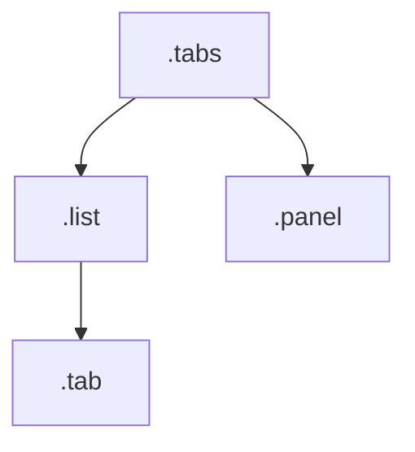

# Example: a documented component

This page walks one real component through the whole loop: the **CSS you write**, the **`cssdoc.json`**
that configures it, **what cssdoc extracts**, and **what linting catches** — then points you to the
[Playground](/guide/playground) to try it live.

## The component

A `tabs` component, documented with `/** … */` doc comments. Everything machine-checkable — the base
class, modifiers, parts, states, and the registered custom property — is read from the actual
selectors, so it can't drift from the CSS. The tags only add prose.

<<< @/examples/tabs.css{css}

## The config

A `cssdoc.json` at the project root. Here it pins the [modifier convention](/guide/modifier-conventions)
to BEM, turns `unknown-modifier` into an error, and requires lowercase component/part names.

<<< @/examples/cssdoc.json{json}

::: tip
The `$schema` line gives you completion and validation for `cssdoc.json` in any editor. See
[Configuration](/guide/config) for every field.
:::

## What cssdoc extracts

cssdoc derives this model from the CSS above — no duplication, no drift:

| Aspect                | Extracted                                                                         |
| --------------------- | --------------------------------------------------------------------------------- |
| **Modifiers**         | `tabs--vertical` (prop `vertical`); `tabs--boxed` — deprecated → `tabs--vertical` |
| **Parts**             | `list`, `tab`, `panel`                                                            |
| **States**            | `selected`                                                                        |
| **Slots**             | `label`                                                                           |
| **Custom properties** | `--tabs-gap` (`<length>`, default `0.5rem`)                                       |

The authored `@structure` becomes a diagram:



An [emitter](/guide/emitters) turns this model into Markdown, HTML, or JSON — so the reference docs
are generated, never hand-written.

## What linting catches

Point the [linter](/guide/linting) at a sloppier component and, under the `cssdoc.json` above, you get:

```css
/**
 * @component alert
 * @modifier alert--old — @deprecated
 */
.alert {
  padding: 1rem;
} /* ✗ missing-summary — the record has no @summary */
.alert--jumbo {
  font-size: 2rem;
} /* ✗ undocumented-modifier — no @modifier description */
.alert--old {
  opacity: 0.6;
} /* ✗ deprecated-requires-canonical — @deprecated with no replacement */
```

…and where the component is consumed:

```html
<!-- ✗ unknown-modifier (error, per cssdoc.json) — alert--bogus isn't a documented modifier -->
<div class="alert alert--bogus">…</div>
```

Each finding carries its rule id, so you can tune severities (`off` / `warn` / `error`) per rule.

## Try it

Edit this component live — CSS, convention, and consumer HTML — in the
[Playground](/guide/playground).
